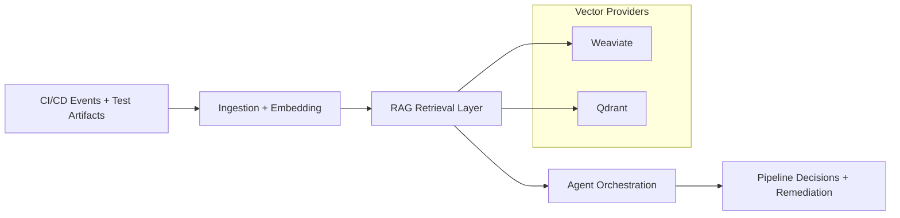
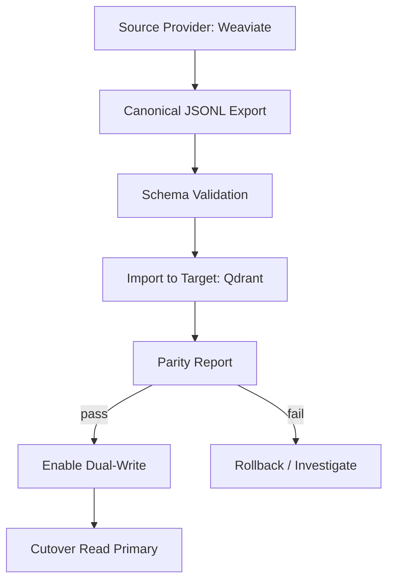
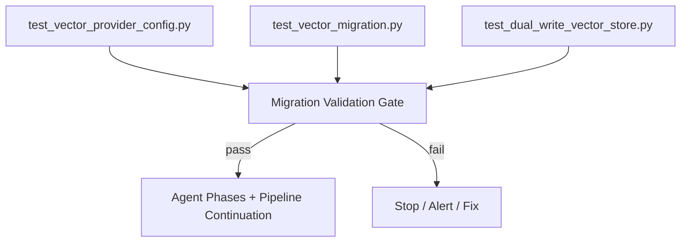
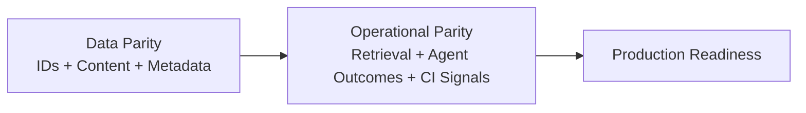

# How We Added an Open-Source Vector Database to a Live RAG Platform Without Breaking Production

## From expiring demo risk to verified feature parity in hours

Our team had a clear infrastructure risk: a cloud vector database demo environment was expiring, and our RAG pipeline depended on it.

We needed a replacement path that was fast, safe, and provably equivalent.

### Constraints (non-negotiable)
- Keep existing behavior stable for dashboard, pipelines, and agents.
- Add an open-source backend now.
- Preserve compatibility with the existing provider for future flexibility.
- Prove parity with tests and CI evidence, not assumptions.

In practical terms, this was not a “database swap.” It was a reliability exercise across a multi-stage pipeline where RAG quality, CI signals, agent behavior, and storage consistency are tightly coupled.

---

## The strategy: abstraction first, migration second, cutover last

Instead of rewriting retrieval logic, we implemented a provider architecture:

1. Add `Qdrant` as a second provider with API parity.
2. Keep `Weaviate` support intact.
3. Introduce canonical export/import tooling for deterministic migration.
4. Add parity validation and dual-write transition controls.
5. Gate everything through targeted tests and CI checks.

This approach minimized blast radius because application code paths remained stable while storage became pluggable.

It also respected an important reality: in an agentic pipeline, vector storage is not isolated infrastructure. It directly affects retrieval relevance, downstream decision quality, and execution outcomes in later pipeline phases.

---

## Visualizing the complex parts (diagram-ready)

To emphasize pipeline complexity in the article, add these diagrams as images (recommended for Medium) or keep the Mermaid source below in your repo.

### Diagram 1: End-to-end architecture (before/after migration)

### Diagram 2: Migration and cutover safety path

### Diagram 3: RAG-aware verification gates in CI

### Diagram 4: Why parity must include operations, not only data

**Medium tip:** Mermaid does not always render natively in Medium. Export each diagram as SVG/PNG (e.g., Mermaid Live Editor, Excalidraw, or draw.io) and insert as images under the matching section.

---

## What we built

### 1) Provider parity layer
We added a `QdrantVectorStore` implementation matching the existing vector store contract.

We also extended configuration and factory routing so provider selection is environment-driven.

**Result:** switching backends became a config change, not a product rewrite.

### 2) Canonical migration toolkit
We implemented migration utilities for:
- canonical JSONL export,
- schema validation,
- idempotent import,
- structural/content parity reporting.

An important detail: parity hashing normalizes migration bookkeeping fields, so we compare real content parity, not metadata artifacts.

### 3) Dual-write cutover mode
We added a `DualWriteVectorStore` wrapper to:
- read from a primary store,
- replicate writes to a secondary store,
- support overlap windows before full cutover.

**Result:** controlled transition with observability, not a hard jump.

### 4) CI/CD integration
We fixed branch trigger behavior in active workflows, then added migration-related validation tests into CI.

We started with a non-blocking check to gain signal safely, while preserving pipeline continuity.

---

## Testing and verification process

### Why verification was intrinsically complex
The migration had to be validated across multiple dependent layers, not a single storage API:
- vector provider behavior,
- migration data integrity,
- RAG retrieval continuity,
- CI/CD workflow orchestration,
- agent-facing reliability signals.

Any silent regression in retrieval could propagate into agent recommendations, triage quality, and pipeline remediation decisions. So parity had to mean both data parity and operational parity.

### Focused migration test suite
We validated provider and migration logic with targeted tests:
- `test_vector_provider_config.py`
- `test_vector_migration.py`
- `test_dual_write_vector_store.py`

Observed local result: **12/12 tests passed**.

These tests were intentionally chosen to protect the RAG-critical path:
- provider routing correctness,
- canonical export/import validity,
- cross-provider parity detection,
- dual-write replication consistency and fallback behavior.

### CI run verification
After workflow trigger correction, feature-branch runs became visible and active. Migration validation was now present in the execution path.

This mattered because verification had to occur in the same operational context where agents and quality gates run, not only in isolated local execution.

### Why this matters for RAG quality
RAG failures during migration are often subtle. Our checks covered the risky surfaces:
- provider routing correctness,
- migration schema integrity,
- record parity across providers,
- dual-write replication behavior,
- retrieval continuity under pipeline conditions.

This reduces silent drift risk in production.

---

## Speed vs traditional execution

Traditional migrations usually involve multiple handoffs across architecture, implementation, QA, and DevOps, often measured in days or weeks.

With AI-assisted engineering and agentic workflows, we completed core parity implementation and verification in a compressed cycle measured in hours.

The acceleration came from:
- rapid codebase exploration,
- direct implementation assistance,
- immediate test feedback,
- CI-backed operational proof.

The key point: speed improved **without** reducing engineering rigor, even with a complex pipeline that required RAG-aware verification before confidence in production rollout.

---

## Business and engineering benefits

1. **Reduced vendor risk:** open-source backend support added.
2. **Operational continuity:** existing provider compatibility preserved.
3. **Safer migration path:** parity checks + dual-write transition.
4. **Higher confidence:** validated by tests and CI evidence.
5. **Reusable architecture:** future providers can be added with less friction.

---

## What this says about AI + CI/CD + agents

This outcome was not just “AI wrote code.”

It was the combination of:
- clear constraints,
- modular architecture,
- migration-specific verification,
- CI/CD enforcement,
- iterative agent-assisted execution.

That stack enabled a fast and reliable infrastructure change under real production constraints.

---

## Final takeaway

If your vector database roadmap is uncertain, you do not need a risky rewrite.

A practical path is:
provider abstraction + canonical migration + parity verification + dual-write cutover + CI gates.

That gives you optionality with proof.
